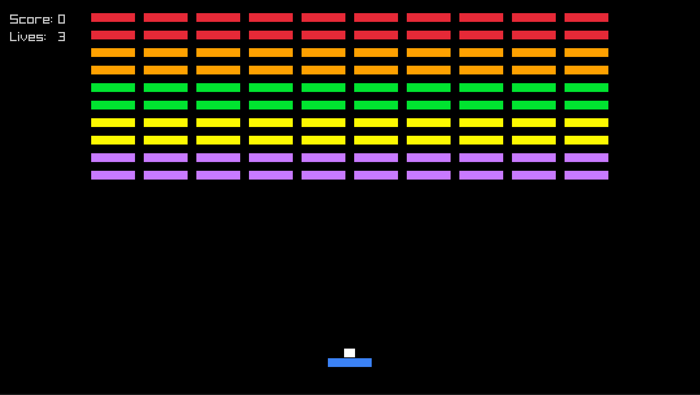

# Breakin



## Run locally

``` sh
# run
odin run .

# build && run
odin build .

./breakin
```

> [!WARNING]
> Only tested on: odin version dev-2026-07-nightly:819fdc7


## wasm
- https://vtraik.github.io/breakin/

## References
- https://en.wikipedia.org/wiki/Linear_interpolation
- https://emscripten.org/docs/getting_started/index.html
- https://github.com/karl-zylinski/odin-raylib-web
